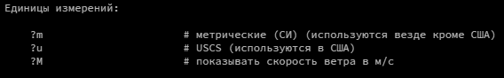

# Получение погоды из терминала

Этот проект создан для отображения погоды в Лондоне, Шереметьево, Череповеце через терминал

### Как установить

[TODO: объясните пользователю, откуда брать ключи, куда их класть и как они выглядят]

Ключи для управления скриптом можно взять из документации и добавить в словарь params
```
https://wttr.in/:help
```
Пример ключей:


Python3 должен быть уже установлен. 
Затем используйте `pip` (или `pip3`, есть конфликт с Python2) для установки зависимостей:
```
pip install -r requirements.txt
```

### Цель проекта

Код написан в образовательных целях на онлайн-курсе для веб-разработчиков [dvmn.org](https://dvmn.org/).